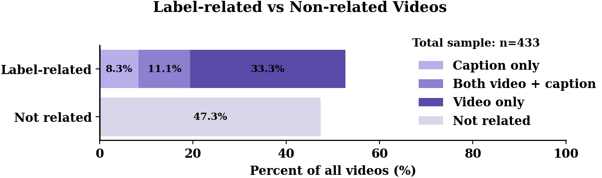
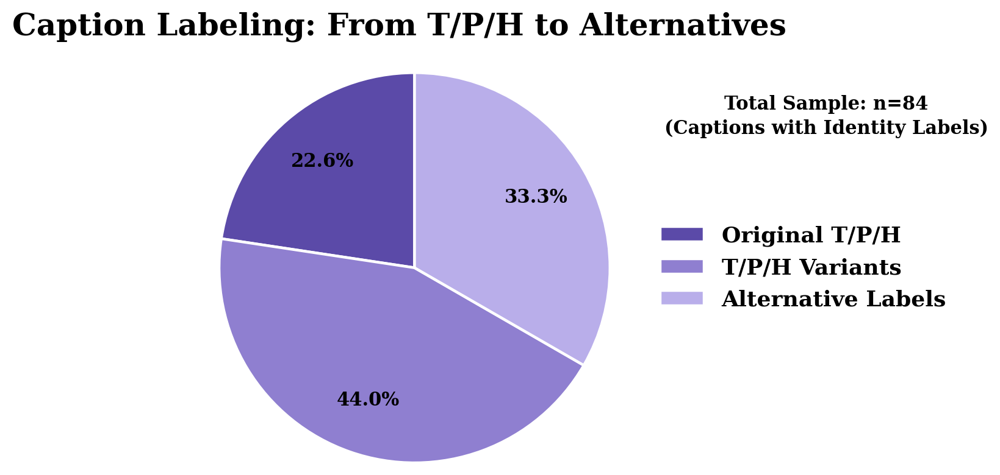
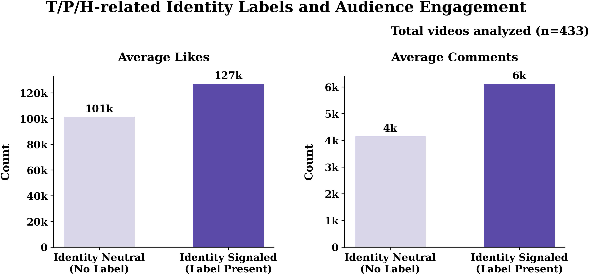

# Results

This folder contains the main research outputs of the project, including data visualizations and summary statistics derived from the final analytic dataset.

---

## Figures

### Figure 1. Label Distribution

This figure shows the overall distribution of label-related and non-related videos in the dataset (n = 433).  
Approximately 52.7% of videos contain identity-related labeling elements, either in captions, visuals, or both. Among these, visual signals ("video only") account for the largest proportion, indicating that identity is often expressed through visual performance rather than explicit textual labeling.

---

### Figure 2. Label Diversification

This figure illustrates the distribution of different types of identity labels used in captions.  
Traditional T/P/H labels account for a smaller proportion compared to variant and alternative labels, suggesting an ongoing diversification of identity expression influenced by platform culture and broader shifts in gender performance.

---

### Figure 3. Engagement Comparison

This figure compares engagement levels between label-related and non-related videos.  
Videos containing identity signals tend to receive higher engagement, with increases in both likes and comments. This suggests that identity labeling functions as a form of platform capital, enhancing visibility and interaction under algorithmic systems.
